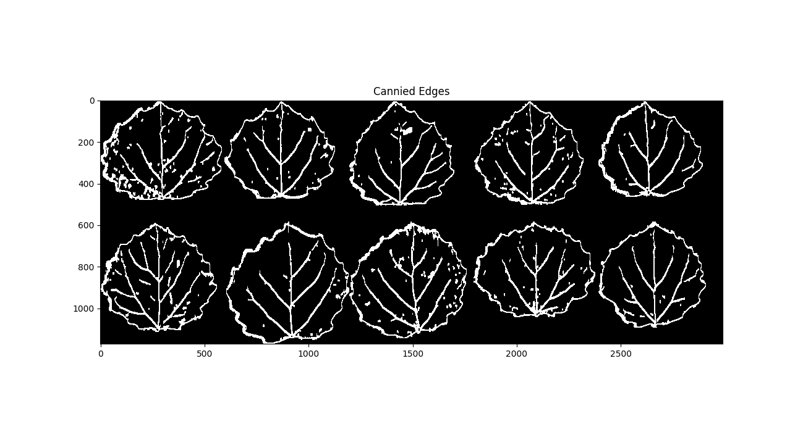
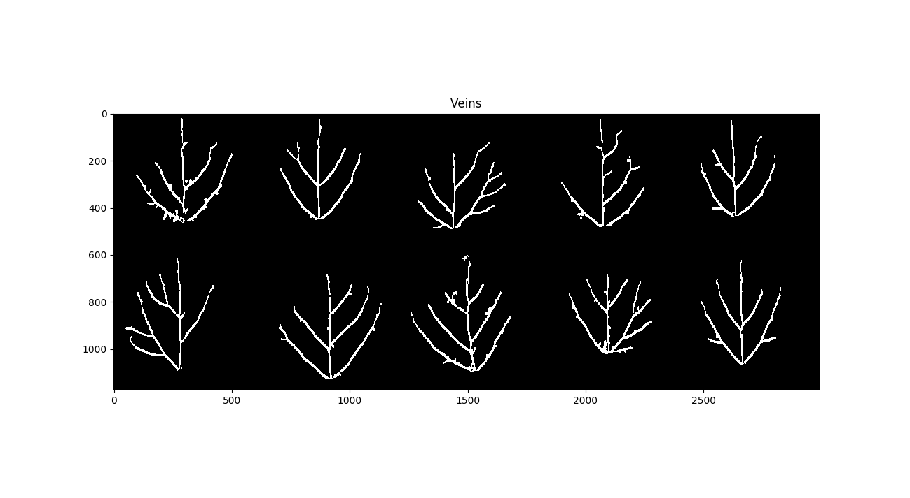
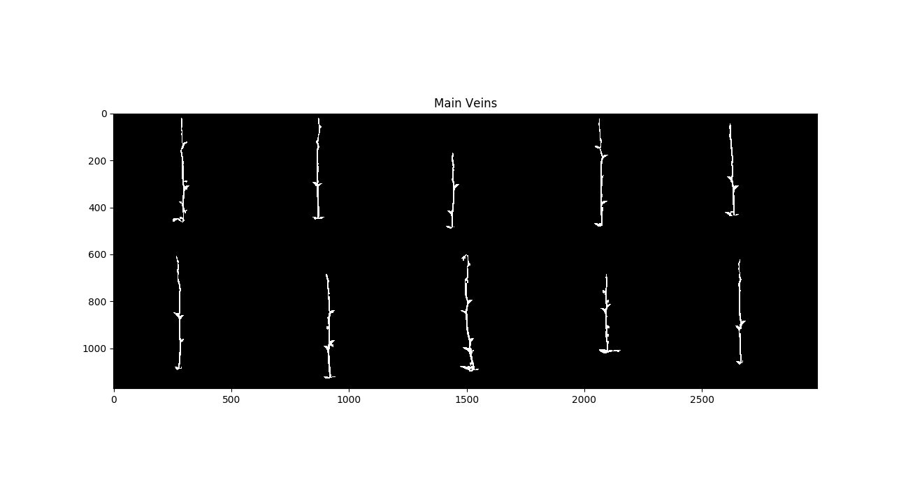
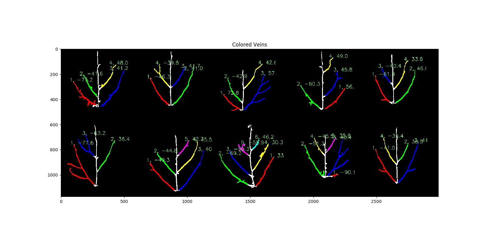
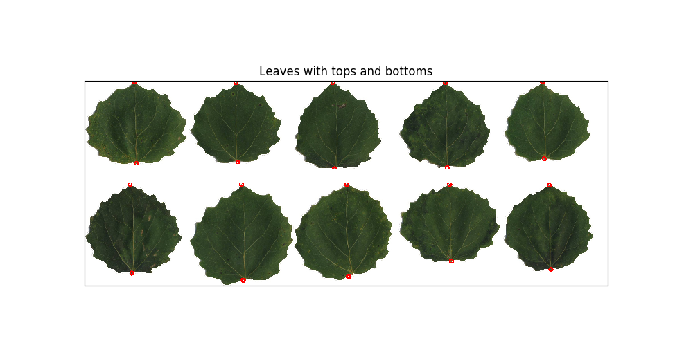

# LeafVeinExtraction
>  To extract leaf veins from scanned leaf groups and save some valuable data, like curvatures.
>
>  Done:
>
>  1. Use K-means to get the **order** of each leaf in current group, then use Radon Transformation to **straighten** the leaf images.
>  2. Use an improved dynamic Canny + Region Growth with two direction to **extract leaf vein** from the scanned leaf groups.
>  3. Use DFT(Discrete Fourier Transformation) to evaluate the **curvatures** of the discrete vein points.
>  4. Use curve-fitting to calculate the **angles** between the main-vein and sub-veins.
>
>  Author: Peng Zheng.

>  Project duration: 6/2017~12/2017, while some data formatting jobs still need to be done.

#### Required_packages:

+ numpy
+ scipy
+ opencv-python
+ scikit-image
+ scikit-learn
+ matplotlib
+ xlsxwriter

## Essential methods:

1. Preprocessing:
   1. Radon transformation.
   2. FloodFill.
   3. K-means
2. Extraction:
   1. Improved Canny.
   2. Region growth.
3. Data formatting:
   1. Discrete Fourier Transformation.
   2. Skeletonization.
   3. Curve fitting.

### Usage:

1. Put the scanned leaf group image in the "split_before" folder.
2. `python main.py`.

### Result:

## TODO:

​	Use superpixel to adapt canny theshold locally.

> If you've ever met any confusion or bug in related algorithms or code, please be not mean about your issue:)

